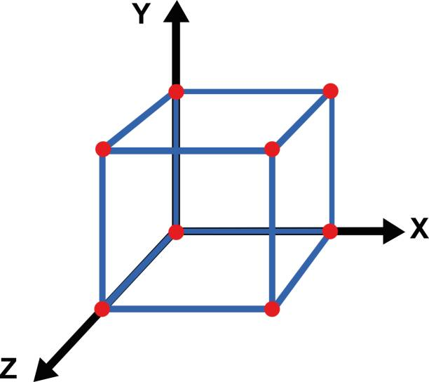
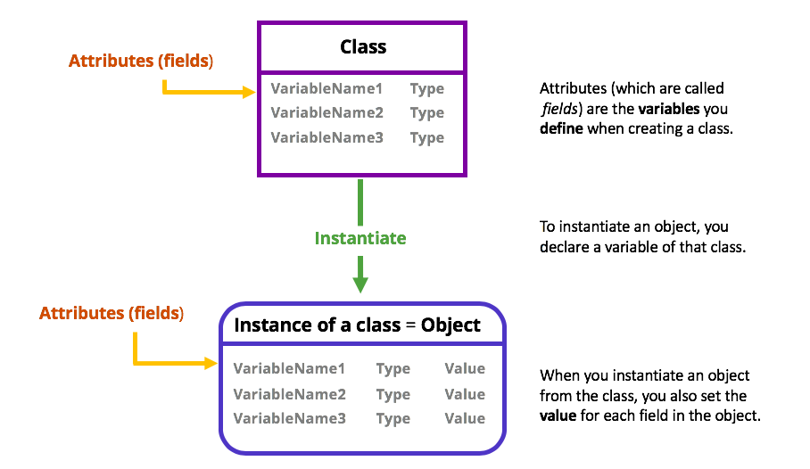
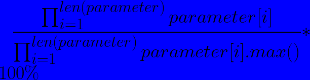

What is Multi Dimensional Decision Making?
---
<!--pause-->
- Multi dimensional decision making is a process of making a decision
<!--pause-->
- Based on multiple dimensions caused by multiple 
<!--pause-->
- __factors__
<!--pause-->
- or __variables__
<!--pause-->
- or __parameters__
<!--pause-->



<!-- end_slide-->

Purpose of Multi Dimensional Decision Making
---
* Choose which objects of same Class is best
* Classes have attributes
* These attributes are parameters for mddm
* MDDM chooses which object to use on basis of the values of these attributes


<!--end_slide-->

Functioning of MDDM
---

* uses;
<!--pause-->
* independent variables as input 
* dependent variable as target decision
<!--pause-->
* takes the product of all values of attributes
* finds the volume of multi-dimensional shape
* finds the percentage of this calculated volume




<!--end_slide-->

Algorithm of Multi Dimensional Decision Making
---
1. Start
2. Create a list of **parameters**
3. Ask for value of parameters
4. Append the value to the list
5. Ask if user wants to add value to another parameter
6. If yes, go to step 3
7. If no, go to step 8
8. Process mddm(multi dimensional decision making) value
9. mddm = product_of_parameters/(parameter_max_rating)^len(parameters)
10. display mddm

<!--end_slide-->

Implementation
---
```python +line_numbers {1-8|9|10,11|12-15|16,17|20,21}
def main():
    print("Welcome to Multi Dimensional Decision Making")
    parameters = []
    max = []
    choice = "y"
    product = 1
    result = 1
    runtime = 0
    while choice == "y":
        if choice == "y":
            print("Enter the parameters")
            for i in range(int(input("Enter the number of parameters: "))):
                parameters.append(int(input("Enter the parameter: ")))
                max.append(float(input(f"Enter the max value for parameter{i}: ")))
                result *= parameters[i] / max[i]
        print(result * 100)
        choice = input("do you want to add values for another object?: ")


if __name__ == "__main__":
    main()
```

<!--end_slide-->
# Thank You!
